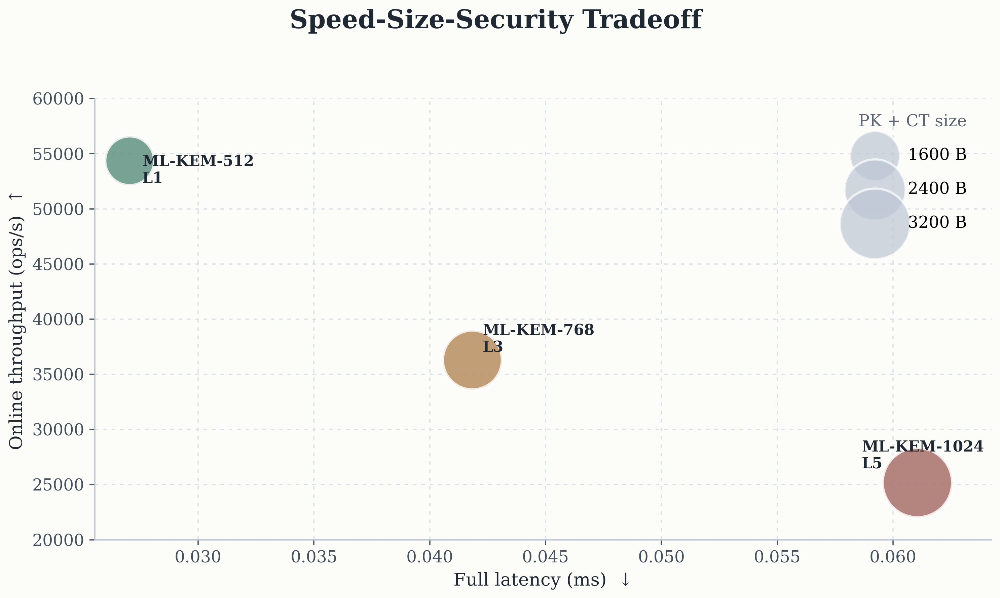
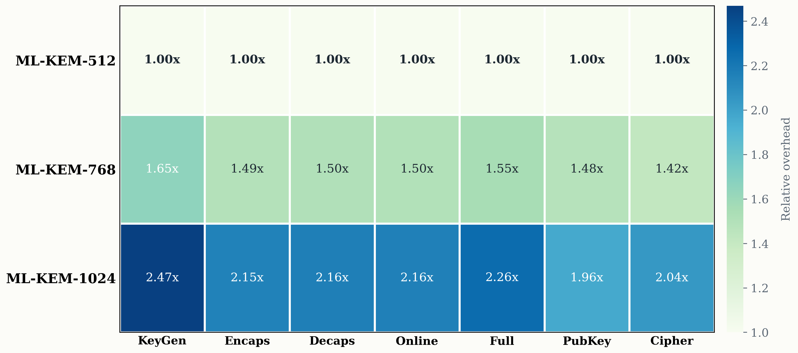
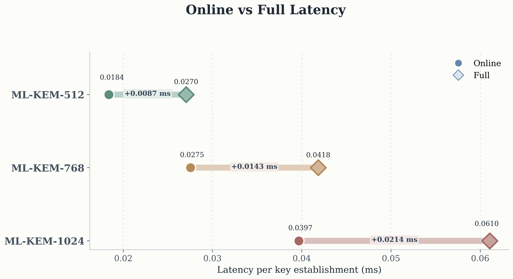
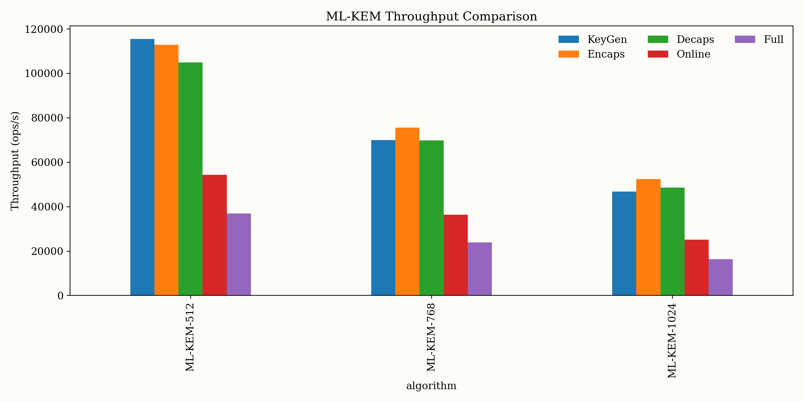

# ML-KEM Performance Analysis

Benchmarking and visual analysis for the three standardized ML-KEM parameter sets:

- `ML-KEM-512`
- `ML-KEM-768`
- `ML-KEM-1024`

This project uses `liboqs-python` to compare correctness, latency, size overhead, full key-establishment cost, and throughput. The output is a small research-style benchmark package with plots, analysis tables, and a presentation deck.

## Overview

The repository follows a simple pipeline:

1. Run correctness checks for all three parameter sets.
2. Benchmark `KeyGen`, `Encaps`, and `Decaps`.
3. Save raw benchmark results to `results.csv`.
4. Generate derived metrics, charts, and summary tables.
5. Assemble a presentation from the generated figures.

```text
test_mlkem_basic.py
        ↓
benchmark_mlkem.py
        ↓
   results.csv
        ↓
   plot_mlkem.py
        ↓
 figures/ + analysis/
        ↓
generate_presentation.py
        ↓
      PPTX
```

## Project Structure

- `test_mlkem_basic.py`: correctness check for key generation, encapsulation, and decapsulation.
- `benchmark_mlkem.py`: repeated timing benchmark for the three ML-KEM parameter sets.
- `plot_mlkem.py`: generates plots and CSV summaries from `results.csv`.
- `generate_presentation.py`: builds the final presentation deck from benchmark outputs.
- `results.csv`: raw benchmark output.
- `figures/`: exported charts and visual summary figures.
- `analysis/`: derived CSV summaries for normalized cost, total cost, and throughput.

## Quick Start

```bash
python3 test_mlkem_basic.py
python3 benchmark_mlkem.py
python3 plot_mlkem.py
python3 generate_presentation.py
```

## Experimental Setup

- Library: `liboqs-python`
- Algorithms: `ML-KEM-512`, `ML-KEM-768`, `ML-KEM-1024`
- Warmup rounds: `20`
- Measured rounds: `500`
- Operations: `KeyGen`, `Encaps`, `Decaps`
- Validation: encapsulated and decapsulated shared secrets must match

## Key Questions

Under the same environment, how do the three standardized ML-KEM parameter sets differ in:

- runtime cost
- communication and storage cost
- full key-establishment cost
- throughput

## Highlights

- `ML-KEM-512` is the fastest and lightest option.
- `ML-KEM-768` provides the clearest balance between stronger security and moderate overhead.
- `ML-KEM-1024` offers the strongest protection, but with the highest latency, size overhead, and throughput reduction.

## Visual Results

### 1. Overall Tradeoff

This figure is the best one-slide summary of the project: it shows the balance among speed, communication size, and security level.



### 2. Relative Overhead

Using `ML-KEM-512` as the baseline makes the security-performance tradeoff easier to explain.



### 3. Full Workflow Cost

For practical deployment, total workflow latency is often more meaningful than a single primitive measured in isolation.



### 4. Throughput Comparison

Higher security levels not only increase single-operation cost, but also reduce system processing capacity.



## Selected Benchmark Snapshot

| Parameter Set | Security Level | Public Key (B) | Secret Key (B) | Ciphertext (B) | KeyGen (ms) | Encaps (ms) | Decaps (ms) |
| --- | ---: | ---: | ---: | ---: | ---: | ---: | ---: |
| ML-KEM-512 | 1 | 800 | 1632 | 768 | 0.008655 | 0.008859 | 0.009530 |
| ML-KEM-768 | 3 | 1184 | 2400 | 1088 | 0.014301 | 0.013227 | 0.014307 |
| ML-KEM-1024 | 5 | 1568 | 3168 | 1568 | 0.021371 | 0.019071 | 0.020608 |

## Generated Outputs

Plots:

- `figures/keygen_time.png`
- `figures/encaps_time.png`
- `figures/decaps_time.png`
- `figures/size_overhead.png`
- `figures/normalized_costs.png`
- `figures/total_key_establishment_cost.png`
- `figures/throughput_comparison.png`
- `figures/visual_heatmap_tradeoffs.png`
- `figures/visual_latency_dumbbell.png`
- `figures/visual_pareto_bubble.png`

Analysis tables:

- `analysis/normalized_costs.csv`
- `analysis/total_costs.csv`
- `analysis/throughput.csv`

Presentation outputs:

- `ML-KEM_Black_Cream_Presentation.pptx`

## Report Topic

Suggested Chinese title:

`ML-KEM-512/768/1024 的性能比较实验与安全代价分析`

## Takeaway

If the goal is minimum overhead, choose `ML-KEM-512`.  
If the goal is the most balanced default, choose `ML-KEM-768`.  
If the goal is maximum security strength and higher cost is acceptable, choose `ML-KEM-1024`.
